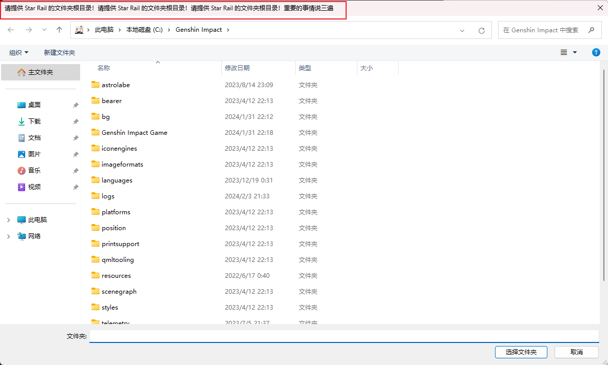
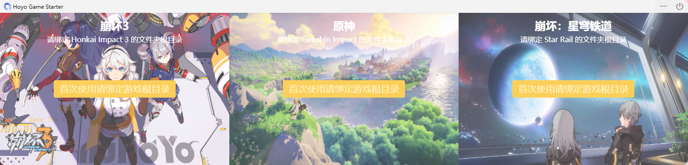
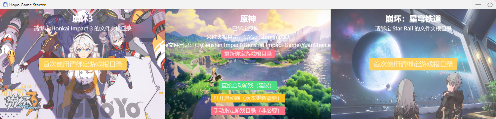

  

  <h1>Hoyo Game Starter</h1>

  <strong>一款米哈游游戏极速整合启动器，收集崩坏3、原神、崩坏：星穹铁道等游戏目录</strong>

  

  
  &nbsp;&nbsp;&nbsp;&nbsp;&nbsp;&nbsp;

  

  
  <a href="https://github.com/mi-saka10032/hoyo-game-starter/releases" target="blank"><strong>📦️ 下载安装包</strong></a>

## ✨ 特性

- **游戏目录统一持久管理，智能识别**
- **游戏启动后自动收进后台**
- **游戏关闭后自动显示**
- **安装包不到10M，运行内存不到5M，极致体验**
- **TODO：添加预下载资源包和游戏更新等功能支持**

## 📜 许可证

[MIT © 2023 mi-saka10032](./LICENSE)

## 使用

首次请针对游戏名称绑定相应的游戏安装**根目录**

按钮语义明确，按照按钮名称操作即可。

 

